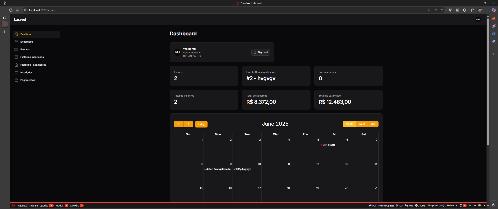
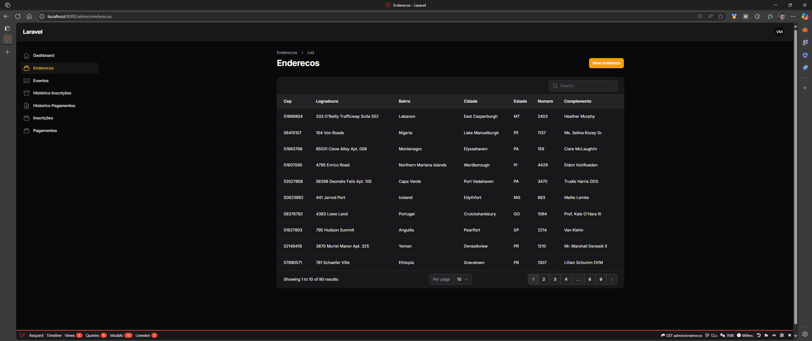
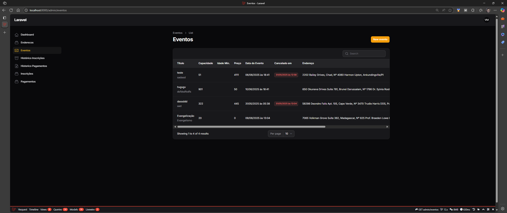
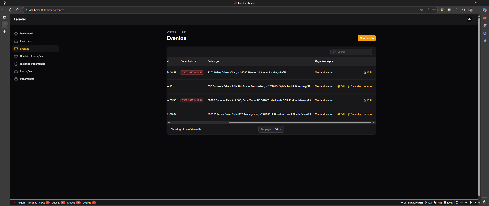
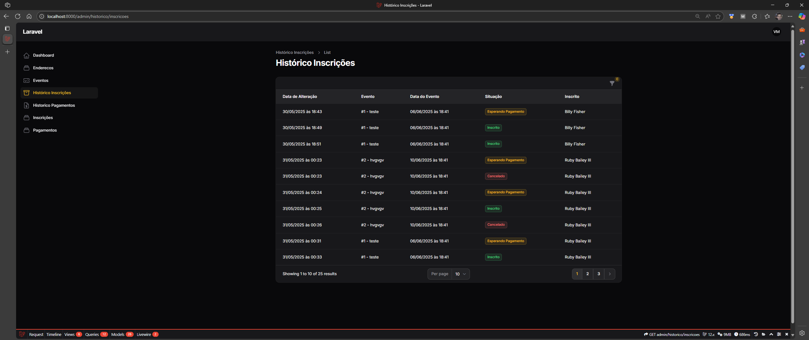
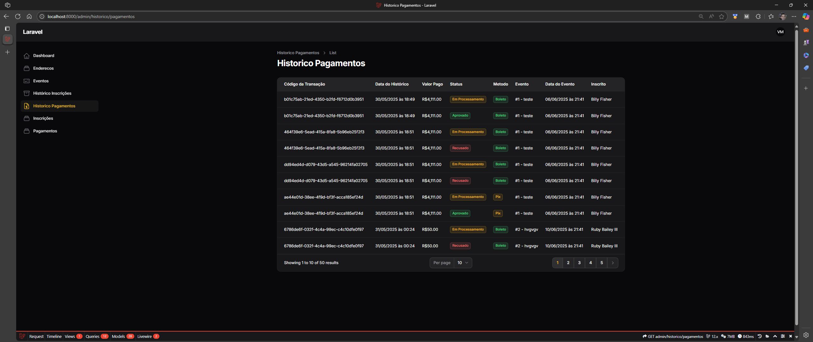
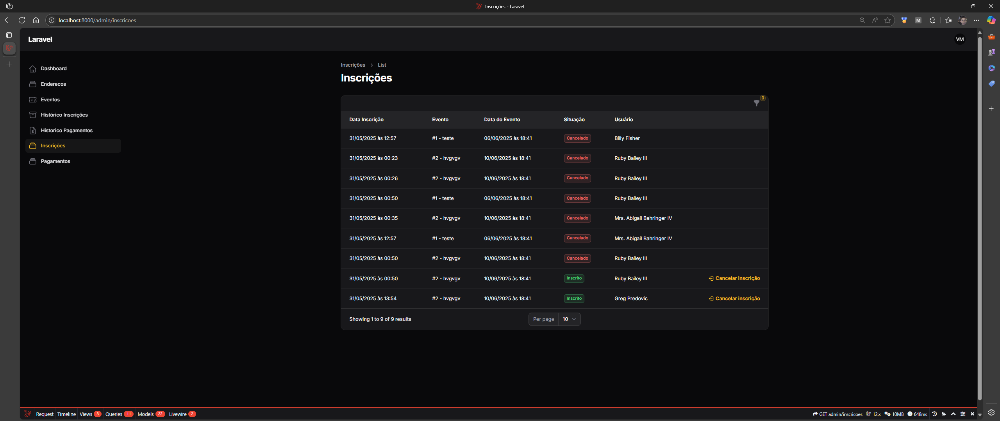
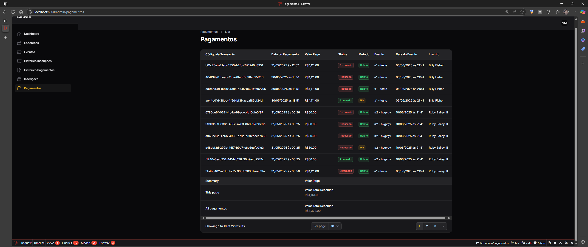
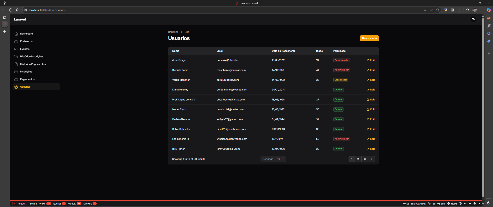

# Desafio para entrevista de emprego com Laravel e Filament

Deverá criar um site em Laravel e Filament para um sistema de eventos

### Informações do Projeto
* Servidor de desenvolvimento: artisan [interno]
* Versão do Php: 8.3
* Frameworks utilizados:
    * Composer
    * Laravel (Já vi por cima, mas nunca mexi)
    * Filament (Descobri agora sobre ele)
* Prazo: Dia 26/05/2025 (Segunda-feira)
* Foi me dado a oportunidade de finalizar mesmo após o prazo

---

### Minhas anotações
Bom pelo que vi, essa é a estrutura do Laravel (achei meio confusa e estranha, mas tem quem goste):
```bash
Root/
├── app/                 => Código principal do projeto
    ├── Http/Controllers => Controllers
    ├── Models           => Models (Abstração de Tabelas)
    ├── Providers        => Injetores de Serviços (Não sei se é o nome correto)
├── config/              => Configurações do Projeto
├── database/            => Informações do Banco de Dados
├── node_modules/        => Dependencias do node
├── public/              => Arquivos compilados do projeto
├── resources/           => Assets do projeto (css, js e views)
├── routes/              => Código para informar as rotas e atalhos de console
├── storage/             => Arquivos temporários (Logs e Sessions)
├── tests/               => Testes unitários
└── vendor/              => Dependencias do composer
```

* Minhas perguntas ao chatGPT: https://chatgpt.com/share/6828dd50-e790-8011-ab36-334dc0222c27
* Playlist criando o projeto: https://www.youtube.com/watch?v=MX5t5-pVDS4&list=PLEna1cPjuN6qDlqeQdjB8poXW_mz8ZaLz&index=8

---

### Imagens
<div style="display: flex;" >
    
    
    
    
    
    
    
    
    
</div>

### Estrutura do banco


### Permissões de Usuários
#### Organizador
Responsável por criar, gerenciar e promover eventos.

- [x] Criar e editar eventos, incluindo detalhes como data, local, descrição e capacidade
- [x] Visualizar lista de inscritos
- [x] Gerenciar inscrições.
- [x] Receber pagamentos
- [x] Acompanhar o status financeiro do evento.

#### Inscrito - Mudei para COMUM
Usuários que buscam participar de eventos, realizando inscrições e pagamentos.
- [x] Procurar eventos por categoria, data ou localização
- [x] Se inscrever em eventos
- [x] Realizar pagamentos
- [x] Visualizar histórico de eventos inscritos e pagamentos efetuados.

#### Administrador
Responsável pela manutenção e supervisão geral do marketplace.
- [x] Gerenciar contas de usuários e organizadores.
- [x] Acessar relatórios de vendas e participação nos eventos.
- [ ] Resolver disputas e questões de suporte.

---

### Entidades
#### Eventos

* [x] Atributos:
    * ID
    * Título
    * Descrição
    * Data
    * Localização
    * Organizador
    * Capacidade
    * Preço
* Funcionalidades:
    - [x] Listagem
    - [x] Busca
    - [x] Inscrição
    - [x] Cancelamento.

#### Inscrições
* [x] Atributos:
    * ID
    * usuário inscrito
    * Evento
    * Data de Inscrição
    * Status
* Funcionalidades:
    - [x] Realização de inscrição
    - [x] Cancelamento
    - [x] Histórico

#### Pagamentos
* [x] Atributos:
    * ID
    * Valor
    * Método de pagamento
    * Status
    * Data
* Funcionalidades:
    - [x] Processamento de pagamentos
    - [x] Histórico
    - [x] Reembolsos

#### Usuários
* [x] Atributos:
    * ID
    * Nome
    * Email
    * Senha
    * Tipo:
        * Organizador
        * Inscrito
        * administrador
* Funcionalidades:
    - [x] Registro (pelo admin)
    - [x] Autenticação
    - [ ] Edição de perfil


### Funcionalidades Adicionais
- [ ] Notificações: Enviar notificações por e-mail ou no aplicativo para lembretes de eventos, confirmações de inscrição, e atualizações importantes.
- [x] Relatórios e Análises: Ferramentas para análise de dados de eventos, inscrições e pagamentos.
- [x] Considerações de Segurança e Privacidade

### Como iniciar o projeto
1. Primeiro é necessário ter o node e o composer instalados no computador...
2. Em seguida abrir o terminal e digitar o comando
```shell
npm install
```
3. E iniciar o banco de dados (está configurado para SQLite local), com os comandos
```shell
php artisan migrate
php artisan db:seed
```
4. O ultimo comando irá listar os usuários que estão sendo criados, juntamente com as permissões e senha
5. Por ultimo, basta abrir o comando para iniciar a aplicação na por 8000
```shell
composer run dev
```